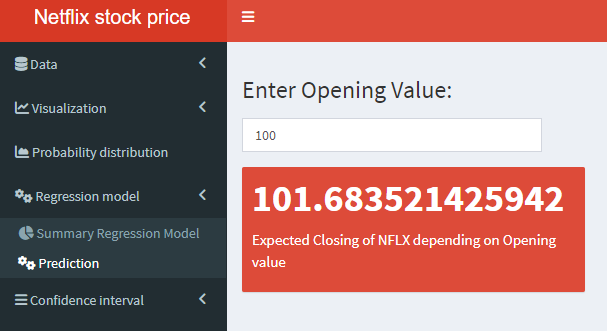

# Netflix-stock-price-prediction-using-R-and-shiny
This is a web application for Netflix stock price prediction developed using R and Shiny (R library for building beautiful dashboards).
##### You can check some screenshots of the website here.
Data Summary:  
   
Line Graph:  
   
Scatter Plot:  
   
Histogram Of Volume:  
   
Probability Distribution:  
   
Summary Regression Model:  
   
Predictions by Regression model:  
   
Descriptive measures confidence interval:  
   
Regression estimates confidence interval:  
   
You can check it's a live demo using this [**link**](https://muhammad3245571106.shinyapps.io/netflixStockPricePredictionAndAnalysis/).
